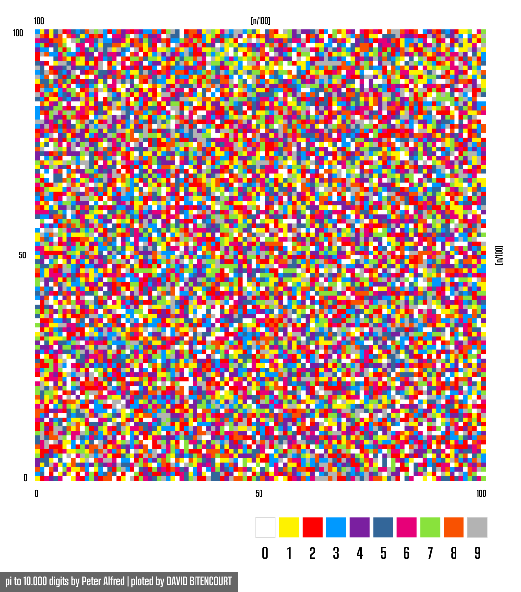

# PixelBoard

> EN | Basically the PixelBoard transforms a vector of up to 10,000 pixel by pixel numbers into an image through colorization. Among other things, it aims at investigating mathematical patterns and behaviors or any other data that can be serialized into numbers.

> PT | Basicamente o PixelBoard transforma um vetor de até 10.000 números pixel a pixel em uma imagem, através da colorização. Dentre outras coisas objetiva fazer investigações sobre padrões e comportamentos matemáticos ou de quaisquer dados de outra natureza que possam ser serializados em números.

#### Example: 10,000 digits of Pi | Exemplo: 10.000 dígitos de Pi.

## Usage Example | Exemplo de Uso

EN | Just add the values in the "pix" vector and choose a theme or make a new one.

BR | Basta adicionar os valores no vetor "pix" escolher um tema ou criar outro.

## Release History | Desenvolvimento

*  0.0.1
    * Work in progress

## Contributing | Contribuição

[pi to 10,000 digits](https://www.math.utah.edu/~alfeld/math/pi.html)
